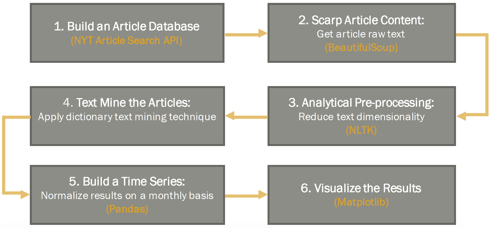

# Text-Mining-The-New-York-Times-Articles

This project covers step-by-step how to mine text from The New York Times' online articles by using Python given a dictionary of words, time range and country of interest. At the same time, it enumerates the key steps to follow in any text mining project, and gives an overview of a specific dictionary text mining technique. The intuition behind this technique is that the frequency of words and their occurrence are good indicators of the topic or sentiment expressed in texts.

## Introducton 

The code is structured in six stages as the figure below shows.

  

## 1 Building an Article Database

Finally, if you are curious about how can text mining be used in Economic Research, take a look at the application in the repository.

Enjoy!

